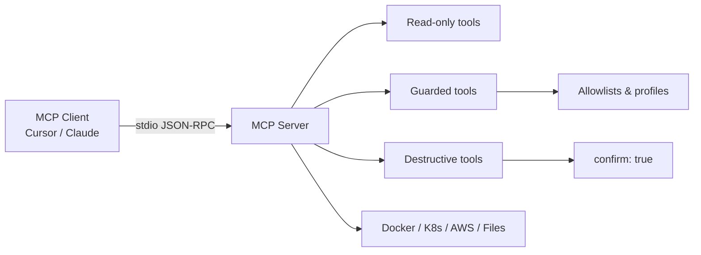

# Architecture

How MCP Hub is organized and how MCP servers communicate with AI clients.

## High-level layout



## Monorepo structure

```
mcp-hub/                    ← Documentation web app (React + Vite)
docker-mcp/                 ← MCP server packages
kubernetes-mcp/
registry-mcp/
cloud-containers-mcp/
cloud-risk-scanner/
incident-timeline-mcp/
api-performance-monitor/
API_ContractValidator/
docs/                       ← Shared markdown documentation
scripts/                    ← verify-build, verify-mcp-servers
```

The web hub is **documentation only** — it does not proxy MCP traffic. Each tool runs as its own Node.js process spawned by the MCP client.

## Server internals

Every MCP server in this repo follows the same pattern:

1. **Entry** (`src/index.ts`) — create MCP `Server`, register handlers
2. **Transport** — `StdioServerTransport` (stdin/stdout JSON-RPC)
3. **Tools** — split under `src/tools/` by risk tier
4. **Config** — allowlists, blocked resources, env-based settings

## Tool tiers

| Tier | Purpose | Example |
|------|---------|---------|
| Read-only | Inspection without mutation | `list_containers` |
| Guarded | Mutations with constraints | `build_image_from_path` |
| Destructive | Requires `confirm: true` | `delete_pod` |

## Build outputs

| Package | Entry after `npm run build` |
|---------|----------------------------|
| docker-mcp, kubernetes-mcp, registry-mcp, cloud-containers-mcp | `build/index.js` |
| cloud-risk-scanner | `dist/src/server.js` |
| incident-timeline-mcp | `dist/server.js` |
| api-performance-monitor, API_ContractValidator | `dist/index.js` |

## Verification pipeline

```bash
npm run build        # Build all workspaces
npm run verify:build # Assert artifacts exist
npm run verify       # Smoke-test tools/list via stdio
npm test             # Run Jest where configured
```

## Further reading

- [Tool Development Guide](./tool-development.md) — add a new server
- [Best Practices](./best-practices.md) — safety and testing guidelines
- [API Reference](./api.md) — tool conventions and env vars
