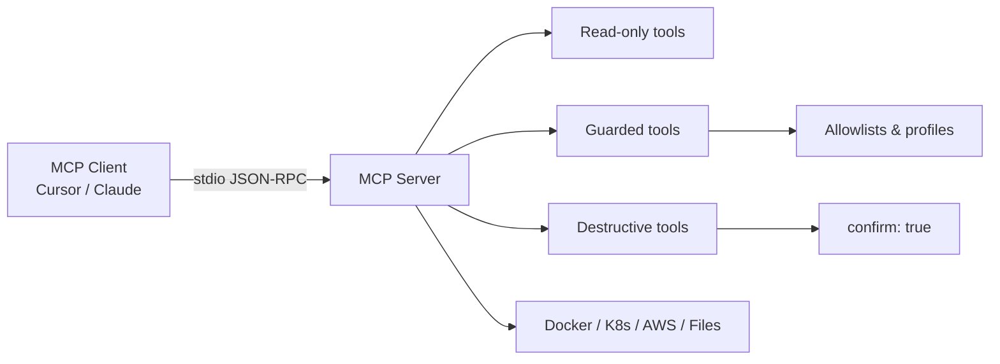

# Best Practices

Guidelines for building and operating MCP Hub tools safely and consistently.

## Architecture overview



Each tool is a **standalone Node.js process**. The web hub (`mcp-hub/`) is documentation only — it does not proxy MCP traffic.

## Safety

1. **Default deny** — Block sensitive resources (Secrets, ClusterRoles) unless explicitly justified.
2. **Namespace / path scoping** — Never allow cluster-wide or filesystem-wide access by default.
3. **Confirmation flags** — Destructive tools must require `confirm: true`, not just a prompt string.
4. **Fail closed** — If config is missing or ambiguous, reject the operation.
5. **No secrets in logs** — Use `console.error` for server diagnostics only; never log credentials.

## Configuration

- Load allowlists from **environment variables** where possible (`ALLOWED_BUILD_PATHS`, `ALLOWED_NAMESPACES`).
- Ship **`.env.example`** for tools with optional auth or integrations.
- Document every env var in the tool README.

## Error handling

Return structured MCP errors to the client:

```typescript
return {
  content: [{ type: "text", text: `Error: ${error.message}` }],
  isError: true,
};
```

Avoid exposing internal stack traces. Include actionable hints ("set confirm: true", "namespace not in allowlist").

## Testing

| Level | What to test | How |
|-------|--------------|-----|
| Unit | Rule engines, parsers, allowlists | Jest |
| Handler | Guard throws on blocked input | `verify.mjs` or Jest |
| Integration | `tools/list` over stdio | `npm run verify` |
| Manual | End-to-end in MCP client | Sample prompts in README |

Target meaningful coverage on safety-critical paths — not 80% line coverage for its own sake.

## Documentation

- One **README per tool** — install, config, env vars, examples
- Keep **web hub** `tools.tsx` in sync with real entry points
- Link to **samples/** directories when available

## Monorepo conventions

- **kebab-case** directory names ending in `-mcp` where applicable
- **TypeScript** for all new code
- **MIT** license on new packages
- Register new packages in root workspaces + verify scripts

## Publishing (future)

When publishing to npm:

1. Use scoped names consistently (e.g. `@amani-patrick/docker-mcp`)
2. Add `"files": ["build"]` or `"dist"` to package.json
3. Update web hub install snippets to `npx` only after publish
4. Tag releases in GitHub with changelog

Until then, **source install is the supported path** — see [Getting Started](./getting-started.md).

## Performance

- Stream large log files (see incident-timeline-mcp) instead of loading into memory
- Set reasonable timeouts on external API calls (registry, AWS)
- Rate-limit HTTP surfaces when exposed publicly

## Community

- Follow [CODE_OF_CONDUCT.md](../CODE_OF_CONDUCT.md)
- Use [Conventional Commits](https://www.conventionalcommits.org/) in PR titles
- Prefer small, reviewable PRs — one tool or one concern at a time
